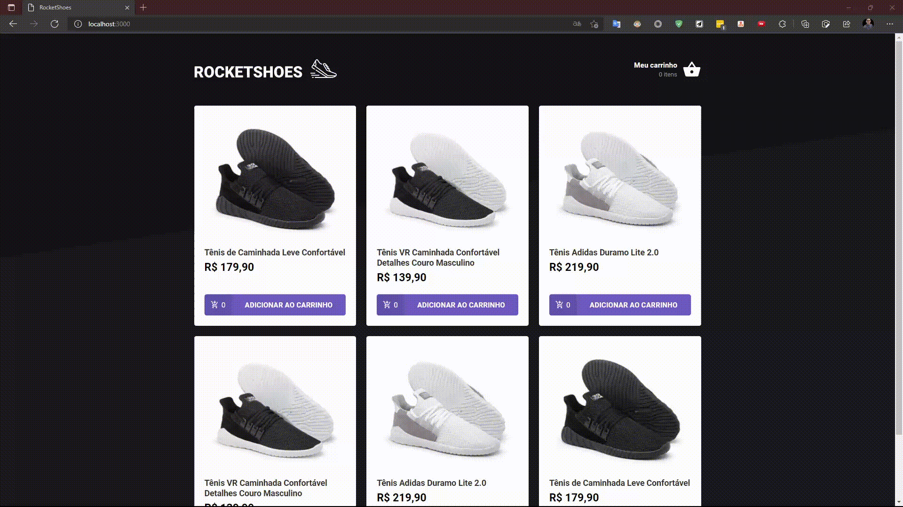

#### Select Language: **English**, [Portuguese](https://github.com/wrtinho/RocketShoes/blob/master/README-pt.md)


<p align="center">
  
</p>

## RocketShoes


[](https://github.com/wrtinho)

<h4 align="center">
  RocketShoes - Ignite challenge - creating a shopping cart hook
</h4>




## Tecnologies

<p align="center">
  <br />
  
</p>

This project was developed using cutting edge front-end technologies.


- [ReactJS](https://reactjs.org/)
- [Typescript](https://www.typescriptlang.org/)

## 💻 Getting started

### Requirements

- You need to install both [Node.js](https://nodejs.org/en/download/) and [Yarn](https://yarnpkg.com/) to run this project.

**Clone the project and access the folder**

```bash
$ git clone https://github.com/wrtinho/RocketShoes && cd RocketShoes
```

**Follow the steps below**

```bash
# Install the dependencies
$ yarn

# Run the backend fake server
$ yarn server

# Run the web server
$ yarn start
```

The app will be available for access on your browser at `http://localhost:3000`

## 📝 License

This project is licensed under the MIT License - see the [LICENSE](LICENSE) file for details.

---

Made with 💜 by Wellington Rodrigues 👋 [Check out my LinkedIn](https://www.linkedin.com/in/wellington123/)
